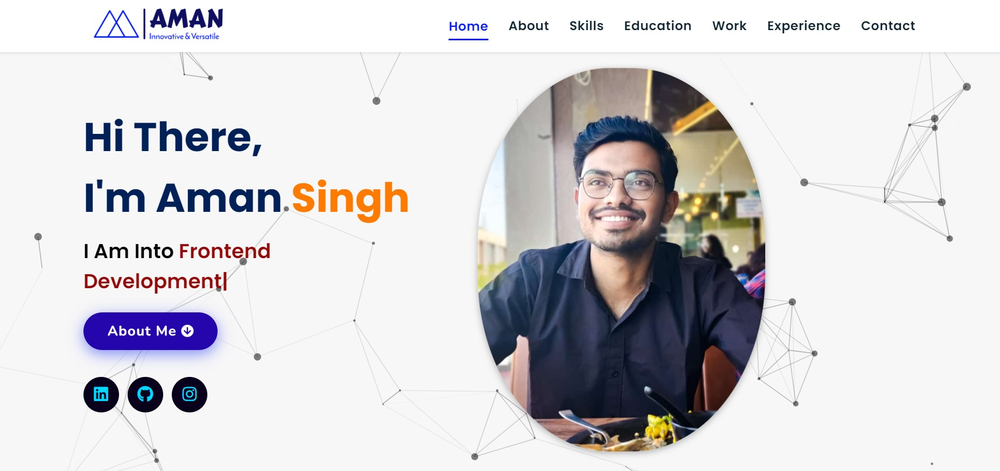

<br/>
<p align="center">
  <a href="https://github.com/amansingh1221/Portfolio">
    
  </a>

  <h3 align="center">Portfolio Website</h3>

  <p align="center">
    Welcome to my portfolio website!
    <br/>
    <br/>
    <a href="https://github.com/amansingh1221/Portfolio"><strong>Explore the docs »</strong></a>
    <br/>
    <br/>
    <a href="https://github.com/amansingh1221/Portfolio">View Demo</a>
    .
    <a href="https://github.com/amansingh1221/Portfolio/issues">Report Bug</a>
    .
    <a href="https://github.com/amansingh1221/Portfolio/issues">Request Feature</a>
  </p>
</p>

      

## Table Of Contents

* [About the Project](#about-the-project)
* [Built With](#built-with)
* [Usage](#usage)
* [Roadmap](#roadmap)
* [Contributing](#contributing)
* [License](#license)
* [Authors](#authors)
* [Acknowledgements](#acknowledgements)

## About The Project



This personal portfolio website is designed and developed using HTML5, CSS3, JavaScript, and jQuery. The website features a clean and modern design with a responsive layout that adapts to different screen sizes. The website showcases my skills, experience, and projects through various sections such as About, Skills, Projects, and Contact. The website includes interactive elements such as smooth scrolling, animated effects, and a hamburger menu for mobile devices. The website is also optimized for search engines and fast loading speed, providing a great user experience for visitors. Overall, this personal portfolio website reflects my creativity, professionalism, and technical abilities as a web developer.

Features:

Responsive design: The website is optimized for viewing on desktop, tablet, and mobile devices.
<br/>Navigation bar: Users can easily navigate through the website using the navigation bar.
<br/>About section: Provides information about my background, skills, and experience.
<br/>Projects section: Showcases some of the projects I have worked on in the past, including links to their GitHub repositories.
<br/>Contact section: Users can easily get in touch with me using the contacts.

Skills:

HTML: Semantic markup for web pages
CSS: Styling and layout of web pages
JavaScript: Adding interactivity and dynamic features to web pages.
jquery


## Built With

This website was built using HTML, CSS, and JavaScript. It showcases my skills and experience as a developer, as well as some of the projects I have worked on in the past.
#### Extras : 
Particle.js, Typed.js, Tilt.js, Scroll Reveal, Font Awesome and JSON

## Usage

Use the below command to run the website on your local machine.
```node app.js```

Here is the link to my Portfolio website: <a href="https://portfolio-amansingh.vercel.app/" target="_blank">**Visit Now** 🚀</a>

## Roadmap

See the [open issues](https://github.com/amansingh1221/ReadME-Generator/issues) for a list of proposed features (and known issues).


## License

Distributed under the MIT License. See [LICENSE](https://github.com/amansingh1221/ReadME-Generator/blob/main/LICENSE.md) for more information.

## Authors

* **Aman Singh** - *Computer Science and Engineering Student* - [Aman Singh](https://github.com/amansingh1221/) - *Personal Portfolio Website*


<br/>
<p align="center">
  <a href="https://github.com/amansingh1221/ReadME-Generator">
    
  </a>

  <h3 align="center">Portfolio Website</h3>

  <p align="center">
    Welcome to my portfolio website!
    <br/>
    <br/>
    <a href="https://github.com/amansingh1221/ReadME-Generator"><strong>Explore the docs »</strong></a>
    <br/>
    <br/>
    <a href="https://github.com/amansingh1221/ReadME-Generator">View Demo</a>
    .
    <a href="https://github.com/amansingh1221/ReadME-Generator/issues">Report Bug</a>
    .
    <a href="https://github.com/amansingh1221/ReadME-Generator/issues">Request Feature</a>
  </p>
</p>

      

## Table Of Contents

* [About the Project](#about-the-project)
* [Built With](#built-with)
* [Usage](#usage)
* [Roadmap](#roadmap)
* [Contributing](#contributing)
* [License](#license)
* [Authors](#authors)
* [Acknowledgements](#acknowledgements)

## About The Project


This personal portfolio website is designed and developed using HTML5, CSS3, JavaScript, and jQuery. The website features a clean and modern design with a responsive layout that adapts to different screen sizes. The website showcases my skills, experience, and projects through various sections such as About, Skills, Projects, and Contact. The website includes interactive elements such as smooth scrolling, animated effects, and a hamburger menu for mobile devices. The website is also optimized for search engines and fast loading speed, providing a great user experience for visitors. Overall, this personal portfolio website reflects my creativity, professionalism, and technical abilities as a web developer.

Features:

Responsive design: The website is optimized for viewing on desktop, tablet, and mobile devices.
<br/>
Navigation bar: Users can easily navigate through the website using the navigation bar.
<br/>About section: Provides information about my background, skills, and experience.
<br/>Projects section: Showcases some of the projects I have worked on in the past, including links to their GitHub repositories.
<br/>Contact section: Users can easily get in touch with me using the contacts.

Skills:

HTML: Semantic markup for web pages
CSS: Styling and layout of web pages
JavaScript: Adding interactivity and dynamic features to web pages.
jquery


## Built With

This website was built using HTML, CSS, and JavaScript. It showcases my skills and experience as a developer, as well as some of the projects I have worked on in the past.
#### Extras : 
Particle.js, Typed.js, Tilt.js, Scroll Reveal, Font Awesome and JSON

## Usage

Use the below command to run the website on your local machine.
```node app.js```

Here is the link to my Portfolio website: <a href="https://portfolio-amansingh.vercel.app/" target="_blank">**Visit Now** 🚀</a>

## Roadmap

See the [open issues](https://github.com/amansingh1221/ReadME-Generator/issues) for a list of proposed features (and known issues).

## Contributing


### Creating A Pull Request

1. Fork the Project
2. Create your Feature Branch (`git checkout -b feature/AmazingFeature`)
3. Commit your Changes (`git commit -m 'Add some AmazingFeature'`)
4. Push to the Branch (`git push origin feature/AmazingFeature`)
5. Open a Pull Request

## License

Distributed under the MIT License. See [LICENSE](https://github.com/amansingh1221/ReadME-Generator/blob/main/LICENSE.md) for more information.

## Authors

* **Aman Singh** - *Computer Science and Engineering Student* - [Aman Singh](https://github.com/amansingh1221/) - *Personal Portfolio Website*

## Acknowledgements

* [ShaanCoding](https://github.com/ShaanCoding/)
* [Othneil Drew](https://github.com/othneildrew/Best-README-Template)
* [ImgShields](https://shields.io/)
